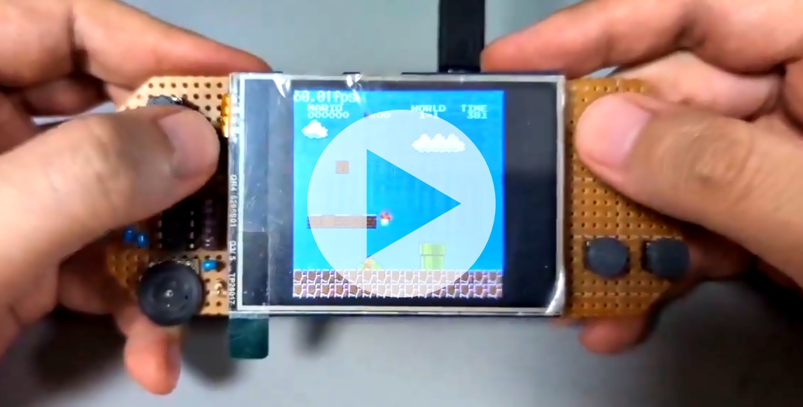
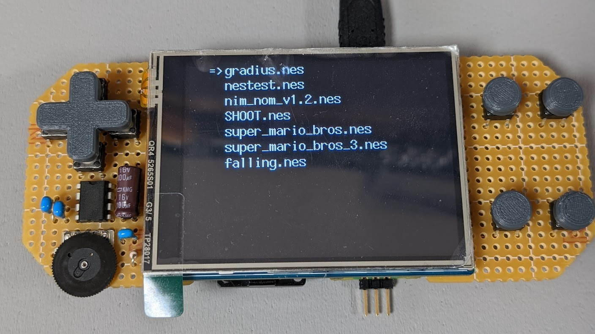
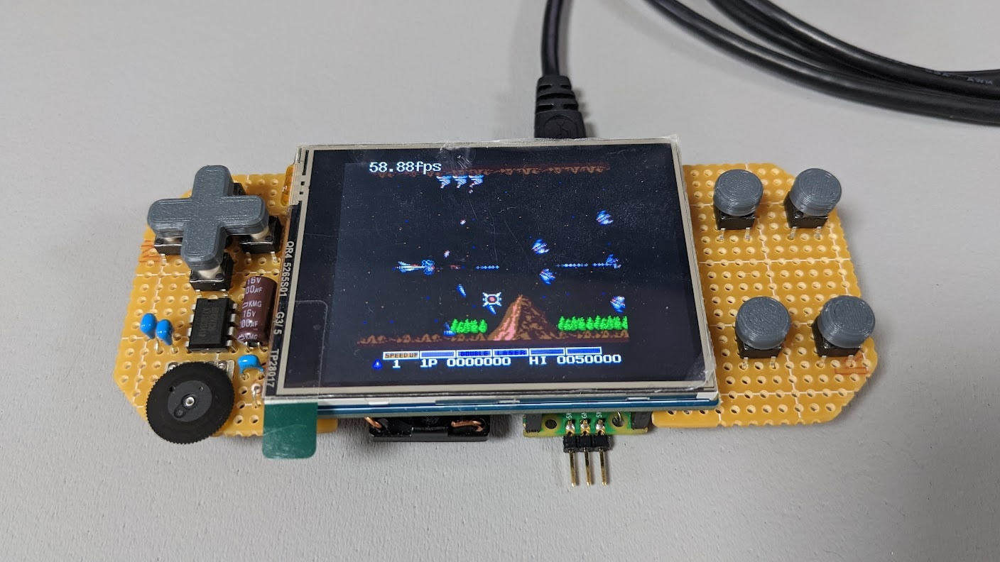
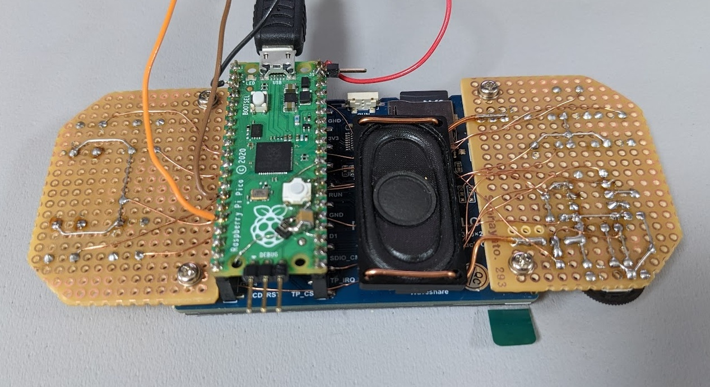
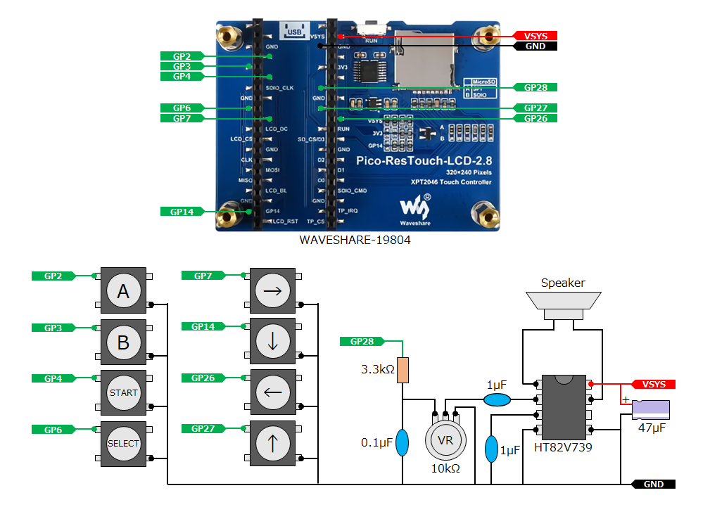
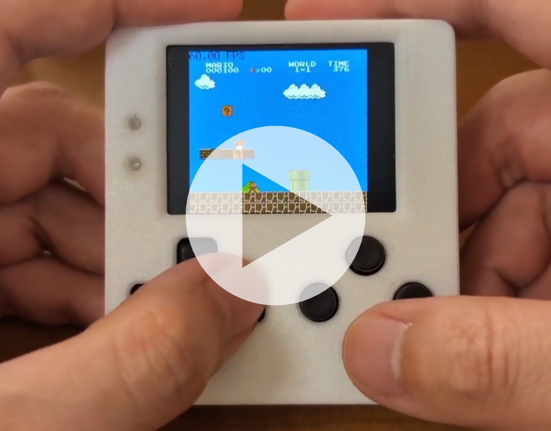
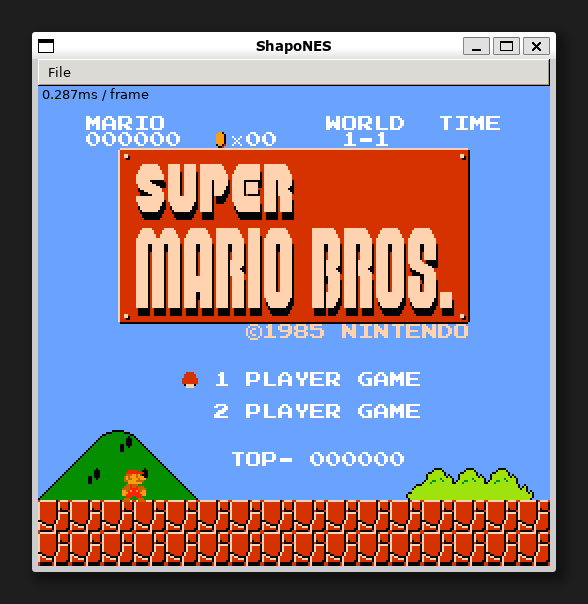

# ShapoNES

an NES emulator for my programming study.

----

## Supported Mappers

|Number|Game (Example)|
|:--|:--|
|000 (NROM)|Super Mario Bros.|
|003 (CNROM)|Gradius|
|004 (MMC3)|Super Mario Bros. 3|

----

## for Raspberry Pi Pico/Pico2 + Waveshare LCD module

A sample application for [Waveshare 2.8inch Touch Display Module for Raspberry Pi Pico](https://www.waveshare.com/pico-restouch-lcd-2.8.htm) supports loading iNES file from SD card.

[](https://x.com/shapoco/status/1834727724797378585)






### How to Build (Linux/WSL2)

1. Install [Pico SDK](https://github.com/raspberrypi/pico-sdk) and CMake.
2. Run the following commands.

    ```sh
    export PICO_SDK_PATH=/path/to/pico-sdk
    git clone https://github.com/shapoco/shapones.git
    cd shapones/samples/pico_ws19804
    make BOARD=pico
    make BOARD=pico2
    ```

    UF2 files generated in `shapones/bin/pico_ws19804/` and `shapones/bin/pico2_ws19804/`.

3. Flash the UF2 file to Pico/Pico2.
4. Place the NES files in the root directory of the microSD card.
5. Set the Pico/Pico2 and the microSD card to the LCD module.

----

## for PicoPad

A sample application for [PicoPad](https://picopad.eu/en/) supports loading iNES file from SD card.

[](https://x.com/shapoco/status/2008424795881488452)

### How to Build (Linux/WSL2)

1. Run the following commands.

    ```sh
    sudo apt install build-essential gcc-arm-none-eabi

    git clone https://github.com/Panda381/PicoLibSDK.git
    export PICOLIBSDK_PATH=${PWD}/PicoLibSDK

    git clone https://github.com/shapoco/shapones.git
    cd shapones/samples/picopad
    make DEVICE=picopad10 clean all
    make DEVICE=picopad20 clean all
    ```

    UF2 files generated in `shapones/bin/picopad10/` and `shapones/bin/picopad20/`.

2. Place the UF2 and NES files under `/EMU/SHAPONES/` on the microSD card.

----

## for PCs (wxWidgets)

A sample application for PCs using wxWidgets and PulseAudio.



### How to Build/Run (WSL2)

1. Install [PulseAudio](https://www.freedesktop.org/wiki/Software/PulseAudio/Ports/Windows/Support/) on Windows and WSL2.

    - [pulseaudioを使ってWSLで音を出す #WSL - Qiita](https://qiita.com/cabbage_lettuce/items/638047742c42f9d6ab63)

2. Install required libraries on WSL2.

    ```sh
    sudo apt update
    sudo apt install libwxgtk3.2-dev pulseaudio libpulse-dev
    ```

3. Build and run.

    ```sh
    git clone https://github.com/shapoco/shapones.git
    pushd shapones/roms
      wget http://nickmass.com/images/nestest.nes
    popd
    pushd shapones/samples/wxapp
      make -j
      make ROM=../../roms/nestest.nes run
    popd
    ```

----

## How to make your own app.
### Adding the ShapoNES Core to the Project

Add `shapones/core/include/` to your include path and add the source files under `shapones/core/src/` to your project.

Include `shapones/shapones.hpp` in your application code.

If you use the `load_ines_file` function described below, add `SHAPONES_SUPPORT_INES_FILE=1` to compiler options.

### Defining Exclusive Control Functions

Implement the following function. The argument `id` takes values ​​from 0 to `nes::NUM_LOCKS - 1`.

- `void nes::lock_init(int id)`: Initializes the mutex or spinlock corresponding to `id`.
- `void nes::lock_deinit(int id)`: Destroys the mutex or spinlock corresponding to `id`.
- `void nes::lock_get(int id)`: Acquires the lock on the mutex or spinlock corresponding to `id`.
- `void nes::lock_release(int id)`: Releases the lock on the mutex or spinlock corresponding to `id`.

If you want the entire emulator to run single-threaded, the function body can be empty.

### Allocating the Output Buffers and Table

- Create a line buffer for image output as a `uint8_t` array. Specify the size as `nes::SCREEN_WIDTH`.
- Create a 64-length color table. The index is the NES color number, and the element is the actual display color (See also: [PPU palettes](https://www.nesdev.org/wiki/PPU_palettes)).
- Create the audio stream buffer as a `uint8_t` array. Specify a size sufficient for your environment.

### Launching iNES File

1. Load the iNES file content into binary array.
2. Pass the binary array of the iNES file as an argument to `nes::memory::map_ines(const uint8_t *ines);`.
3. Get the default configuration structure with `auto cfg = nes::get_default_config()`, modify the settings as needed, and pass it to `nes::init(const nes::Config& cfg)`.
    - `cfg.apu_sampling_rate`: Specifies the audio stream sampling frequency in Hz.
4. Pass the audio stream buffer to `nes::apu::service(uint8_t *buff, int len)` to fill the buffer and begin playback.

Steps 1 and 2 can be completed on PC using `nes::load_ines_file(const char* path)` if `SHAPONES_SUPPORT_INES_FILE=1` is defined.

### Main Loop

Call the following functions within the application loop:

- `nes::cpu::service();`
- `nes::ppu::service(uint8_t *line_buff);`

Pass the line buffer as an argument to `nes::ppu::service`. `nes::ppu::service` returns true when the buffer is filled. Then, convert the buffer contents into actual pixel values ​​using the color table and write them to the display or frame buffer.

These functions can run on separate CPU cores. In that case, the mutual exclusion functions mentioned above must be correctly implemented.

### Audio Stream Output

When the audio stream buffer is empty, fill it using `nes::apu::service(uint8_t *buff, int len)`.

The audio data is zero during silence, has only positive amplitude, and has a maximum value of 255. Because this value has a large DC bias, you must implement a DC cut filter if necessary.
