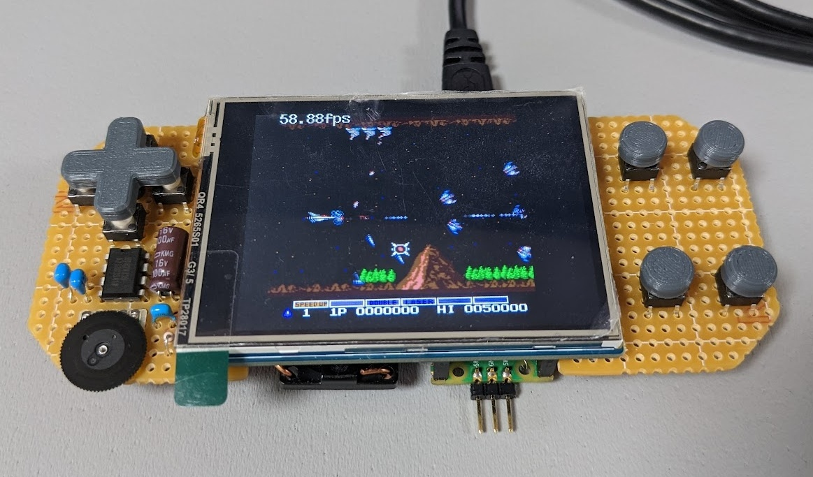

# ShapoNES

an NES emulator for my programming study.

----

## Supported Mappers

|Number|Game (Example)|
|:--|:--|
|000|Super Mario Bros.|
|003|Gradius|

----

## for Raspberry Pi Pico/Pico2 + Waveshare LCD module

A sample application for [Waveshare 2.8inch Touch Display Module for Raspberry Pi Pico](https://www.waveshare.com/pico-restouch-lcd-2.8.htm) supports loading iNES file from SD card.

[](https://x.com/shapoco/status/1834727724797378585)





### How to Build (Linux/WSL2)

1. Install [Pico SDK](https://github.com/raspberrypi/pico-sdk) and CMake.
2. Run the following commands.

    ```sh
    export PICO_SDK_PATH=/path/to/pico-sdk
    git clone https://github.com/shapoco/shapones.git
    cd shapones/samples/pico_ws19804
    make BOARD=pico
    make BOARD=pico2
    ```

    UF2 files generated in `shapones/bin/pico_ws19804/` and `shapones/bin/pico2_ws19804/`.

3. Flash the UF2 file to Pico/Pico2.
4. Place the NES files in the root directory of the microSD card.
5. Set the Pico/Pico2 and the microSD card to the LCD module.

----

## for PicoPad

A sample application for [PicoPad](https://picopad.eu/en/) supports loading iNES file from SD card.

[](https://x.com/shapoco/status/2008424795881488452)

### How to Build (Linux/WSL2)

1. Run the following commands.

    ```sh
    sudo apt install build-essential gcc-arm-none-eabi

    git clone https://github.com/Panda381/PicoLibSDK.git
    export PICOLIBSDK_PATH=${PWD}/PicoLibSDK

    git clone https://github.com/shapoco/shapones.git
    cd shapones/samples/picopad
    make DEVICE=picopad10 clean all
    make DEVICE=picopad20 clean all
    ```

    UF2 files generated in `shapones/bin/picopad10/` and `shapones/bin/picopad20/`.

2. Place the UF2 and NES files under `/EMU/SHAPONES/` on the microSD card.

----

## for PCs (wxWidgets)

A sample application for PCs using wxWidgets and PulseAudio.


### How to Build/Run (WSL2)

1. Install [PulseAudio](https://www.freedesktop.org/wiki/Software/PulseAudio/Ports/Windows/Support/) on Windows and WSL2.

    - [pulseaudioを使ってWSLで音を出す #WSL - Qiita](https://qiita.com/cabbage_lettuce/items/638047742c42f9d6ab63)

2. Install required libraries on WSL2.

    ```sh
    sudo apt update
    sudo apt install libwxgtk3.2-dev pulseaudio libpulse-dev
    ```

3. Build and run.

    ```sh
    git clone https://github.com/shapoco/shapones.git
    pushd shapones/roms
      wget http://nickmass.com/images/nestest.nes
    popd
    pushd shapones/samples/wxapp
      make -j
      make ROM=../../roms/nestest.nes run
    popd
    ```
