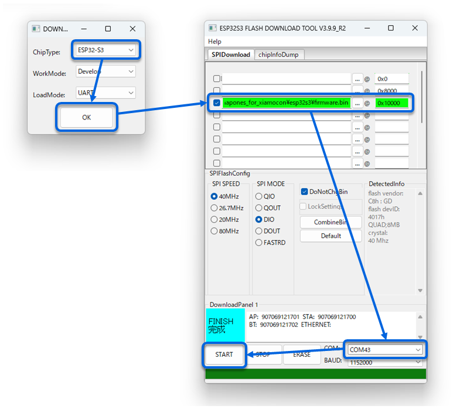

# ShapoNES for Xiamocon

## バイナリの書き込み方法

### RP2350 版

Xiamocon を USB で PC に接続し、書き込みモードにして
shapones_for_xiamocon.uf2 を書き込んでください。

### ESP32S3 版

Xiamocon を USB で PC に接続し、
[Flash Download Tool](https://docs.espressif.com/projects/esp-test-tools/en/latest/esp32/production_stage/tools/flash_download_tool.html)
を使用してアドレス 0x10000 に firmware.bin を書き込んでください。



## 使用方法

### キーアサイン

ABXY ボタンは次のようにマッピングされています。

```
       SELECT
         |
        (X)
B--- (Y)   (A) ---START
        (B)
         |
         A
```

### 起動

TFカードに NES ファイルを格納し、Xiamocon にセットして
電源を入れると NES ファイルの一覧が表示されるので、
上下キーで選択して A ボタン (Xiamocon の B ボタン) で起動します。

FUNC キーでメニューを表示し、別の NES ファイルを起動することもできます。

### セーブ/ロード

現状、カートリッジのセーブ機能はサポートしていないので
電源を切るとゲームの状態は失われます。

代わりに FUNC キーでメニューを表示し、
左右キーでステートタブ (フロッピーディスクのアイコン) に切り替え、
スロットを選んで A ボタンでステートをロードまたは保存できます。

メニュー表示中もゲームは進行するので、
必要に応じてメニューを開く前にポーズしてください。

ロードが失敗した場合、再度ロードを実行すると成功することがあります。


